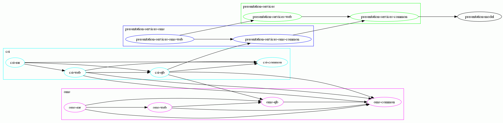

# This project is in heavy development

# maven Plug-In zur Visualisierung von Dependencies.  

Analysiert alle Dependencies in einem Ordner (i.e. eclipse Workspace) und generiert daraus einen Graphviz Graph. 
Der Graph muss dann mit einem Graphiz gerendert werden.   

Beispiel-Graph:   

